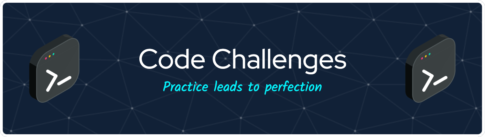

<!-- ALL-CONTRIBUTORS-BADGE:START - Do not remove or modify this section -->

<!-- ALL-CONTRIBUTORS-BADGE:END -->
  

## What is this project about?
The programming world is always changing, and we as developers are tested to prove our technical skills in every selection process we do.
This project was done to share different tests applied by companies worldwide so that the dev community can practice and improve, knowing what to expect when it's their turn to apply for a job.

## Table of contents

- [Overview](#what-is-this-project-about)
- [Front-end](./front-end/FRONT.md/#front-end-tasks)
- [Back-end](./back-end/BACK.md/#back-end-tasks)

    

## Contributors ✨

Thanks goes to these wonderful people ([emoji key](https://allcontributors.org/docs/en/emoji-key)):

<!-- ALL-CONTRIBUTORS-LIST:START - Do not remove or modify this section -->
<!-- prettier-ignore-start -->
<!-- markdownlint-disable -->
<table>
  <tr>
    <td align="center"><a href="https://riantavares.dev/"> <b>@RianTavaresDev</b></a> <a href="https://github.com/RianTavares/code-challenges/commits?author=RianTavares" title="Documentation">📖</a></td>
  </tr>
</table>

<!-- markdownlint-restore -->
<!-- prettier-ignore-end -->

<!-- ALL-CONTRIBUTORS-LIST:END -->

This project follows the [all-contributors](https://github.com/all-contributors/all-contributors) specification. Contributions of any kind welcome!