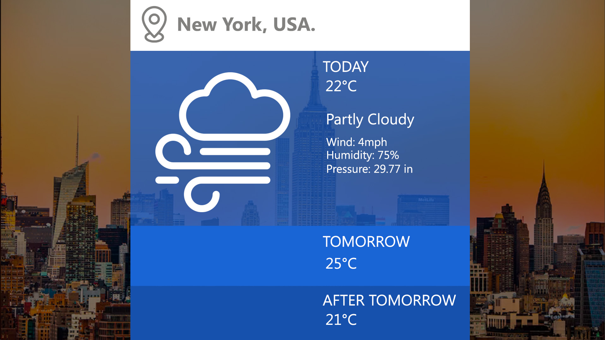

# Weather App

### Summary 

Tech: &nbsp;
&nbsp;
 
Level: Advanced | [Front-end](../../front-end/) Senior 
 
Rate: 🟡 🟡 🟡 🟡 ⚪️ 4/5
 
[Solutions](#solutions)

## About the challenge

1. Build a responsive site to show the weather in the locations informed in the white text box, as in the image below
   
 
   

       
   

 

1. Your solution must follow the layout, but you can suggest improvements. Describe these improvements in the README and explain why. You gain extra points if these improvements are positive or lose points otherwise.

   ** Icons can be found at [meteocons](https://www.alessioatzeni.com/meteocons/) or at [The noun project](https://thenounproject.com/)
   
2. The white text box must be an input, wich the user can change the locale.
   
3. With the change of location, the application must load the weather information for this new location.
   
4. The browser's API must obtain the user's geographic coordinates to discover the city's name via reverse geocode as soon as the page loads.
   
5. Bing's featured image should be used as the desktop background. ([Bing's API](https://www.bing.com/HPImageArchive.aspx?format=js&idx=0&n=1&mkt=pt-BR))
   
6. Note that there is a gradient superimposed on the original image. In fact, this color reflects the current temperature of the location chosen for the three dates.
   
7. If the user clicks on any temperature, the temperatures must be changed from Celsius to Fahrenheit or from Fahrenheit to Celsius.
   
   - For temperatures below 25ºC, shades of blue should be used. 
   - For temperatures above 35ºC, shades of red should be used.
   - Shades of yellow should be used for other temperatures. 
   - When there is no location chosen, shades of gray should be used as a base for the gradient. 

8. Forecasts for: today, tomorrow, and the day after tomorrow should be shown.
   
9. To consult the weather forecast, use the [OpenWeather](http://api.openweathermap.org/data/2.5/weather?q=%7B%7Blocation_name%7D%7D&APPID=your_app_id) informing the name of the location instead of {{location_name}}. Create a new account to have an app id and use it instead of {{your_app_id}}.
   
10. To convert latitude and longitude to a locale, use [OpenCage](https://api.opencagedata.com/geocode/v1/json?q=%7B%7Blatitude%7D%7D,%7B%7Blongitude%7D%7D&key=your_key_here&language=en). Create a new account to have a key and use it instead of {{your_key_here}}.

## Requirements

- We recommend doing the challenge using React, but you can use other libraries or frameworks (Angular, Vue.js, etc.) or pure JavaScript (Vanilla JS).
- For the style sheet, you can use whatever you like (CSS, SASS, LESS, CSS Modules, CSS-in-JS, etc.).
- Preferably use Webpack. If you prefer, you can use create-react-app or similar. Doing your own Webpack setup gives you extra points.
- Your app should be ready for production. Create a Docker for production and one for the development gives you extra points.

## Evaluation Criteria

- <strong>Runs as expected:</strong> Does the step-by-step request to run the application work?
- <strong>Code organization:</strong> Separation of modules and project organization (back-end and front-end).
- <strong>Clarity:</strong> Does the README briefly explain what the problem is and how to run the application?
- <strong>Assertiveness:</strong> Is the application doing what is expected? If something is missing, does the README explain why?
- <strong>Code readability:</strong> Is the code easy to read and understand? Are there too many cryptically named variables/functions? Do comments in the code helps explain the flow?
- <strong>Security:</strong> Are there any apparent vulnerabilities?
Test coverage Quality and tests coverage (we do not expect complete coverage).
- <strong>Commit history:</strong> Quality and structure of commits.
- <strong>UX:</strong> Is the interface user-friendly and self-explanatory? Are the API routes/methods intuitive?
- <strong>Technical choices:</strong> Is the choice of libraries, architecture, etc., the best choice for the application?

 

 
<strong>What do you think about this challenge?</strong>

Give a star 🌟 if you enjoy it
 
 
If you have developed a solution for this challenge, don't forget to contribute to this project and add your repository link below. 

 

## Solutions

| Github User        | Solution Repository           
| ------------- |:-------------:|
| [Your Git User](https://github.com/RianTavares) | [www.your-solution-repo-here.com](https://github.com/RianTavares) | 
